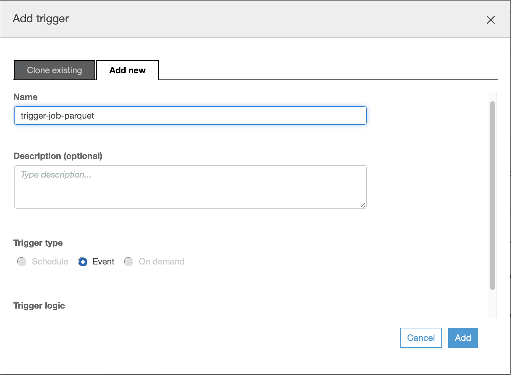
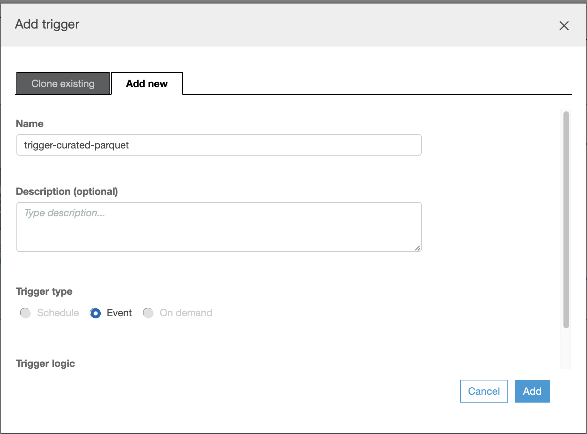

[0-Prerequisites](../00_Prerequisites/README.md) > [1-Ingestion](../01_ingestion_with_glue/README.md) > 2-Orchestration > [3-Interactive-SQL](../03_interactive_sql_queries/README.md) > [4-Visualisation](../04_visualization_and_reporting/README.md) > [5-Transformations](../05_transformations/README.md) > [99-Conclusion](../99_Wrap_up_and_clean/README.md)

# Lab 2 Orchestrating the data pipeline

- [Orchestrate the data pipeline using the Workflow feature](#orchestrate-the-data-pipeline-using-the-workflow-feature)
  - [Reviewing the results](#reviewing-the-results)
  - [Troubleshooting FAQS](#troubleshooting-faqs)
- [Orchestrate YOUR data pipeline using Workflows](#orchestrate-your-data-pipeline-using-workflows)

In this lab we will continue to work with [Glue](https://aws.amazon.com/glue/) and convert the raw datasets we have extracted in [the previous lab](../01_ingestion_with_glue/README.md) into curated data sets in an automated way.

> **Note**: This Lab depends on the steps executed in the [Ingestion with Glue](../01_ingestion_with_glue/README.md) LAB;
In case you didn't finish that one yet, now is the time :)

> &#128161; **Info**: Glue is a fully managed extract, transform, and load (ETL) AWS service that makes it easy for customers to prepare and load their data for analytics. Glue allows you to create crawlers that will generate a schema for each of your csv file. Glue also allows you to create Job to do complex process for your datasets such as conversion to another data type.

At this stage, we have Glue crawlers and a Glue Job configured convert our raw datasets into Parquet and generate Glue tables for both raw and generated data. We should be able to observe 2 main folders in our data-lake bucket (raw and curated).

## Orchestrate the data pipeline using the Workflow feature

When you only have a Glue job or a single Crawler that needs to be run periodically, you can schedule it with Glue scheduler or maybe you can use [CloudWatch](https://aws.amazon.com/cloudwatch/) events with a [Lambda](https://aws.amazon.com/lambda/) function. But if you need more complex flows - for example chaining multiple jobs and crawlers, running different jobs in parallel - Glue provides a workflow mechanism.

> &#128161; **Info**: CloudWatch is a monitoring and management AWS service that provides data and actionable insights for AWS, hybrid, and on-premises applications and infrastructure resources. With CloudWatch, you can collect and access all your performance and operational data in form of logs and metrics from a single platform.

> &#128161; **Info**: Lambda is an event-driven, serverless computing AWS service that runs code in response to events and automatically manages the computing resources required by that code. 

The example presented here assumes a linear/ dependent approach - some jobs will run before running the others. The goal is to create a pipeline which will refresh the data-set every once in a while. One  example of a dependent job is a job that extracts data from other source and ingest it into your data lake before kicking off another transformation jobs.

In this lab, we will automate the following manual steps we did in the [Ingestion with Glue](../01_ingestion_with_glue/README.md) LAB:

* Crawl raw datasets from S3 bucket and ingest data into Glue tables
* Curate and transform raw datasets into parquet
* Crawl Parquet/ curated datasets and ingest curated data in Glue tables

The updated diagram of what we previously did including the crawler should look something like this:

Now, let's automate this process so we don't have to worry about it...

Once we are done in this lab, it should look something like this:

Let's get started

1. Go to the Glue Dashboard in AWS Console
2. Navigate to the *Workflows* in the *ETL* section on the left side-pane.
3. Click on the **Add Workflow** button
4. Add a name for our workflow (e.g. `byod`) and press the **Add Workflow** button;

Now, in the newly created workflow, 

1. Click on **Add Trigger**
2. Select the *Add New* tab
3. Define a *Name* for the new trigger (e.g. `trigger-crawler-rawdata`); If you encounter problems in creating the trigger, one possibility is you have created a trigger before with the same name. See [Troubleshooting FAQS](#troubleshooting-faqs)
4. Select Trigger Type as Schedule

5. Specify the *Frequency* before you press **Add** (let's say you run this workflow once a day);

6. Configure the crawler that is going to be triggered. Click **Add Node**

7. Select the crawler that needs to run first- In this case, we want the raw data crawler created in the first step (you probably named it **{choose-name}-initial-ds**), then click **Add**.

Until this point it should look something like this: 

> **Note**: If you have multiple datasets, you will need to repeat the last step 6 - 7 to trigger the crawler for each dataset. You can add multiple nodes in the trigger created by just clicking the trigger then **Add Node**

8. Set up the automated job that converts data into parquet. For that click on the crawler (raw-sale-initial-ds in the previous image) and then click in **Add Trigger**

9. Select Add new at the top and give it a name (e.g. `trigger-job-parquet`). The trigger type Event should be already selected and the option Start after ANY watched event as well. If you encounter problems again in creating the trigger, one possibility is you have created a trigger before with the same name. See [Troubleshooting FAQS](#troubleshooting-faqs). After done, it should look something like this:

To this point, the workflow should look like this:

10. Click on the trigger and then **Add Node**

11. Select the job that needs to run - In this case, we want the transformation job created in the [Ingestion with Glue](../01_ingestion_with_glue/README.md) LAB  (you probably named it **TABLE-NAME-1-job**), then click **Add**.

> **Note**: If you have multiple tables, you will need to repeat the last step to trigger job of each table.

We are almost there, however there's one more thing left; we need to add the crawler for the curated data - continue with the following steps

12. Click on the job node created in the last step (sales_data-job in this image) and then click in **Add Trigger**.

13. Select Add new tab. Choose a name (e.g. `trigger-crawler-curateddata`) and the trigger to be **Event** and select the option Start after ALL watched event.

> **Note**: At this point, if you have multiple tables and you have created multiple jobs (1 job per table), please do the following to add other jobs to watch:
- Click on the created trigger
- Click <b>Action</b> menu in the top right of the diagram.
- Choose <b>Add jobs/crawlers to watch</b>
- Mark other jobs to be watched as checked and click <b>Add</b>

14. Click on the trigger, and then **Add Node**.

15. Add the curated crawler to be triggered (In this case the crawler created in the previous step - you probably named it something like this {choose-name}-curated-ds)

To this point, the workflow should be complete and should look like this

### Reviewing the results

After completing the steps above, we are now ready to try our new workflow, click on **Run** in the **Actions** menu.

Once you selected a job, you can monitor the execution status in the *History* TAB in the bottom panel; If the job(s) succeeded, visit the *Metrics* TAB to see resource utilisation and data movement information; Also note that the jobs can take quite a bit of time to end, about 15 minutes in total.

When jobs succeed, you should find in your S3 bucket a folder called *curated* with subfolders for all your tables.

By selecting the latest Job and clicking on the **View run details**, you can monitor the execution results of the data processing pipeline:

Once the pipeline succeeded at least once, we should be able to observe the newly created databases in the data catalog.

When you navigate to the **Tables**, you will observe tables created from your data files. The output is similar to the [Ingestion with Glue](../01_ingestion_with_glue/README.md) LAB but this one was run in an automated (workflow) way.

"What can I do with it?", you may wonder. Stay tuned, we will cover this in details in the next session.

### Troubleshooting FAQS

1. Why is it that everytime I add a trigger it tells me that the trigger is already associated with another one?  
  Answer: *It is possible that you have created a trigger with the same name before. Go to the Glue dashboard in AWS console and then go to Triggers under the ETL section. You will see there that you have previously created a trigger with the same name before. One way to fix it is to specify a different name for the new trigger you are creating. Another option is to delete the trigger with the same name and then recreate it again.*

2. Why did my workflow failed when I try to run it?  
  Answer: *You can check your different nodes in the workflow. One of the nodes failed. You can manually run each of them one at a time to see which nodes are failing. It will also help you if you will check each of the output you were expecting to find out which node didn't produce the expected output you want. From there, you can investigate on your node (crawler or job) on why it is failing.*

3. Why did my workflow didn't run in sequence?  
  Answer: *Check the triggers you defined. It might be a misconfiguration in the trigger that is causing it to run in an unexpected way.*

## Orchestrate your data pipeline using Workflows

We just walked you through an example, now its time you think about your own workflow case. Which are those jobs that have to run on a recurring/ schedule basis? 

Please note that this was a linear job, but you can run some jobs in parallel, you can add them in parallel in the pipeline.
Think about how your workflow will look like, you can ask help to one of the support members from AWS.

Now go to lab 3 : [Interactive SQL Queries](../03_interactive_sql_queries/README.md)
