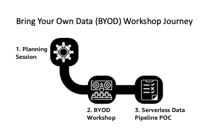

# Bring Your Own Data Labs (BYOD)

Bring Your Own Data (BYOD) labs help you build a serverless data pipeline based on your own data. Starting from a sample of your data saved in Amazon S3, you will go through an intensive workshop that focuses on transforming, analysing and visualizing your data.

## Your Data Journey

1. Your journey into the data lab starts with a planning session to review the account and data pre-requisites of the workshop, setup  and the requirements of any datasets that you will use as well as to scope out the final dispostion of the data pipeline that you will create.

2. Once you have met all the pre-requisites, you will complete the modules in the workshop, in which you will tranform, analyse, and visualize your data.

> &#128161; To help prepare your data for this lab and verify that your data is in the proper format and locations, a *Data Validation Tool* has been created for you to deploy and use. You can learn more about this tool in [this section](90_data_preparation_tool/README.md).

3. At the completion of the workshop, you will have a POC on which you can continue to evolve into a more complex data pipeline and deriving more insights. You will be leveraging [AWS Glue](https://aws.amazon.com/glue/) for the data catalogue and run ETL on the data lake; [Amazon Athena](https://aws.amazon.com/athena/) to query the data lake; and [Amazon QuickSight](https://aws.amazon.com/quicksight/) for data visualization.
 
*Required Account and Access pre-requisites*

* Basic knowledge of AWS foundational services such as IAM and S3, as well as basic SQL knowledge.
* AWS IAM user with admin privileges or an AWS IAM user with full access to S3, Glue, Athena, and QuickSight [Insert Sample Jason Policy]

## Getting Started !

Ready to get started ?

* [Check the Data Pre-requisites](00_Prerequisites/README.md)
* [Start lab 1 directly](01_ingestion_with_glue/README.md)

---
## License

This library is licensed under the Apache 2.0 License. 
